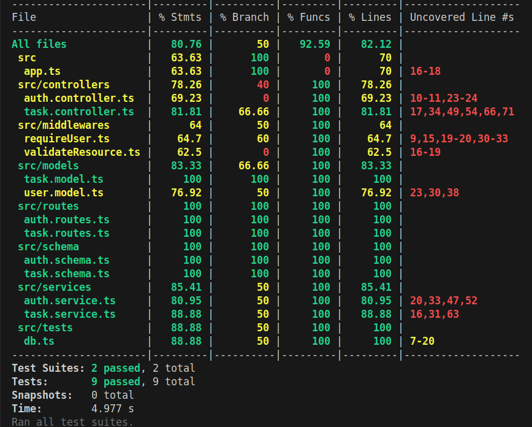

# 🚀 Task Management API (Backend)

A robust, production-ready REST API for managing tasks with user authentication. Built with scalability and performance in mind using **Node.js, Express, MongoDB, and Redis**.

<p align="center">
  
</p>


## ✨ Key Features

* **🔐 Secure Authentication:** JWT-based stateless authentication with Zod validation.
* **⚡ High Performance:** Implemented **Redis Caching** (Read-Through strategy) to reduce database load.
* **🐳 Dockerized:** Fully containerized environment (API + Mongo + Redis) using Docker Compose.
* **🛡️ Type Safety:** End-to-end type safety with **TypeScript** and **Zod**.
* **✅ Testing:** Integration tests with **Jest** & **Supertest** achieving >80% code coverage.
* **🏗️ Architecture:** Clean Layered Architecture (Controller -> Service -> Data Access).

---

## 🛠️ Tech Stack

* **Runtime:** Node.js (v20)
* **Framework:** Express.js
* **Language:** TypeScript
* **Database:** MongoDB (Mongoose)
* **Caching:** Redis (Read-Through Pattern)
* **Validation:** Zod
* **Testing:** Jest, Supertest, MongoDB-Memory-Server
* **DevOps:** Docker, Docker Compose, GitHub Actions

---

## 🚀 Getting Started

### Prerequisites

* Node.js (v18+)
* Docker & Docker Compose (Optional, for containerized run)

### Option 1: Run with Docker (Recommended)

The easiest way to run the entire stack (App + DB + Cache).

```bash
# 1. Clone the repository
git clone https://github.com/aqeell7/mini-task-tracker.git
cd mini-task-tracker

# 2. Create .env file (or use provided example)
echo "JWT_SECRET=supersecretkey" > .env

# 3. Build and Run
docker-compose up --build
```

The API will be available at: **http://localhost:5001**

### Option 2: Run Locally (Manual)

```bash
# 1. Install Dependencies
npm install

# 2. Start Services (Ensure you have local MongoDB and Redis running)
# Or update .env to point to your cloud instances

# 3. Run in Development Mode
npm run dev
```

---

## 🧪 Testing

This project uses Jest for integration testing. We mock Redis and use an in-memory MongoDB instance to ensure tests are fast, isolated, and do not require external infrastructure.

```bash
# Run all tests
npm test

# Run with coverage report
npm test -- --coverage
```

### Test Coverage Results

*Note: We achieved >80% coverage across Controllers, Services, and Utilities.*

---

## 📂 Project Structure

```bash
src/
├── config/         # Database & Redis configuration
├── controllers/    # Request handlers (Input/Output)
├── middlewares/    # Auth checks & Zod validation
├── models/         # Mongoose Schemas
├── routes/         # API Endpoint definitions
├── schema/         # Zod Validation Schemas
├── services/       # Business Logic & Caching
├── tests/          # Integration Tests
├── app.ts          # App setup (Express)
└── server.ts       # Server entry point
```

---

## 📝 API Endpoints

| Method | Endpoint | Description | Auth Required |
|--------|----------|-------------|---------------|
| POST | `/api/auth/signup` | Register a new user | ❌ |
| POST | `/api/auth/login` | Login and get JWT | ❌ |
| GET | `/api/tasks` | Get all tasks (Cached) | ✅ |
| POST | `/api/tasks` | Create a new task | ✅ |
| PUT | `/api/tasks/:id` | Update task status | ✅ |
| DELETE | `/api/tasks/:id` | Delete a task | ✅ |


